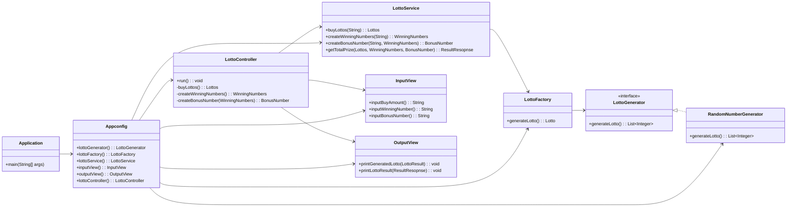
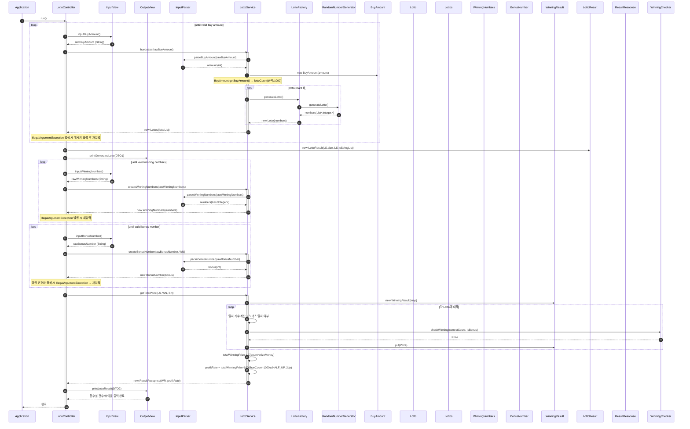

# java-lotto-precourse

## 기능 목록

### 메인 로직
- [x] 사용자가 입력한 구입금액을 검증한다. (구입 금액은 1,000으로 나누어 떨어지는 양의 정수다.)
- [x] 구매한 로또의 갯수만큼 로또를 발행한다. (로또는 1~45 사이의 중복되지 않는 숫자를 6개를 가진다.)
- [x] 사용자가 입력한 당첨 번호를 검증한다.
- [x] 사용자가 입력한 보너스 번호를 검증한다.
- [x] 발행한 각 로또에 대해 당첨 여부를 확인하고 결과를 합산한다.
- [x] 당첨 여부에 따른 총 수익액을 계산한다.
- [x] 로또 구입금액에 따른 총 수익률을 계산한다. (수익률은 소수점 둘째 자리에서 반올림한다.)

### 입력 및 출력
- [x] 시작 시 안내 메시지를 출력한다. (`구입금액을 입력해 주세요.`)
- [x] 사용자로부터 문자열을 입력 받는다.
- [x] 구매한 로또 갯수를 출력한다. (`n개를 구매했습니다.`)
- [x] 발행한 로또 번호를 출력한다. 로또 번호는 오름차순으로 정렬하여 보여준다.
- [x] 당첨 번호 입력 메시지를 출력한다. (`당첨 번호를 입력해 주세요.`)
- [x] 당첨 번호를 입력 받는다. 번호는 쉼표(`,`)를 기준으로 구분한다.
- [x] 보너스 번호를 입력 받는다.
- [x] 당첨 통계를 출력한다.

### 예외처리
- [x] 입력된 구입 금액이 양의 정수가 아닌 경우 `IllegalArgumentException`을 발생시킨다.
- [x] 입력된 구입 금액이 1,000으로 나누어 떨어지지 않는 경우 `IllegalArgumentException`을 발생시킨다.
- [x] 입력된 구입 금액이 2,147,483,000 이상인 경우 `IllegalArgumentException`을 발생시킨다.
- [x] 입력된 로또 번호의 개수가 6이 아닌 경우 `IllegalArgumentException`을 발생시킨다.
- [x] 입력된 로또 번호가 1~45의 범위를 넘어선 경우 `IllegalArgumentException`을 발생시킨다.
- [x] 입력된 로또 번호가 중복된 숫자를 가질 경우 `IllegalArgumentException`을 발생시킨다.
- [x] 입력된 당첨 번호의 개수가 6이 아닌 경우 `IllegalArgumentException`을 발생시킨다.
- [x] 입력된 당첨 번호가 숫자가 아닌 경우 `IllegalArgumentException`을 발생시킨다.
- [x] 입력된 당첨 번호가 1~45의 범위를 넘어선 경우 `IllegalArgumentException`을 발생시킨다.
- [x] 입력된 당첨 번호가 중복된 숫자를 가질 경우 `IllegalArgumentException`을 발생시킨다.
- [x] 입력된 보너스 번호가 숫자가 아닌 경우 `IllegalArgumentException`을 발생시킨다.
- [x] 입력된 보너스 번호가 숫자가 1~45의 범위를 넘어선 경우 `IllegalArgumentException`을 발생시킨다.
- [x] 입력된 보너스 번호가 당첨 번호에 포함될 경우 `IllegalArgumentException`을 발생시킨다.

### 추가적인 조건
- [x] 구입 금액이 0일 경우 잘못된 입력으로 판단한다.
- [x] 구입 금액 자료형은 int로 설정한다. 그러므로 발행할 수 있는 로또의 최대 개수는 2,147,483개이다.
- [x] 당첨 번호를 쉼표로 구별할 때 공백은 허용한다

## 프로젝트 구조

### 의존성 다이어그램

### 시퀀스 다이어그램

